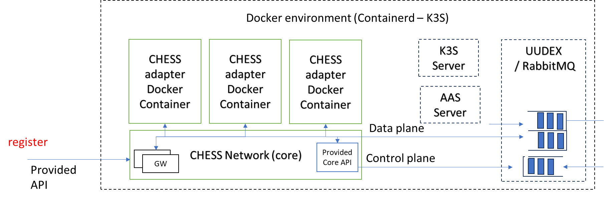
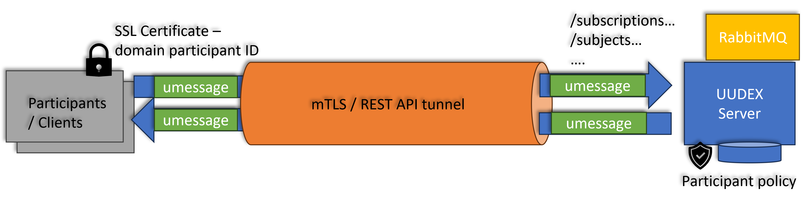
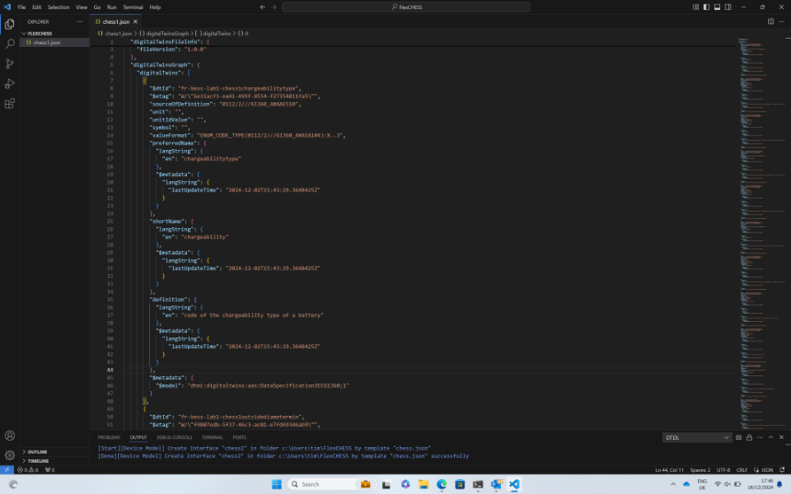
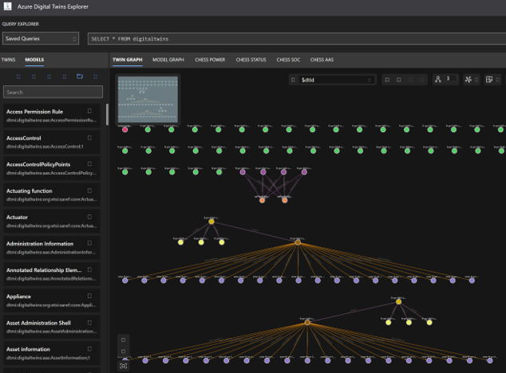
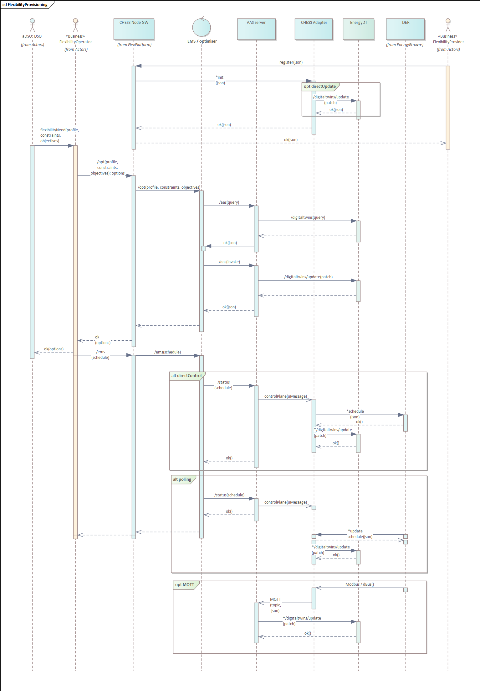
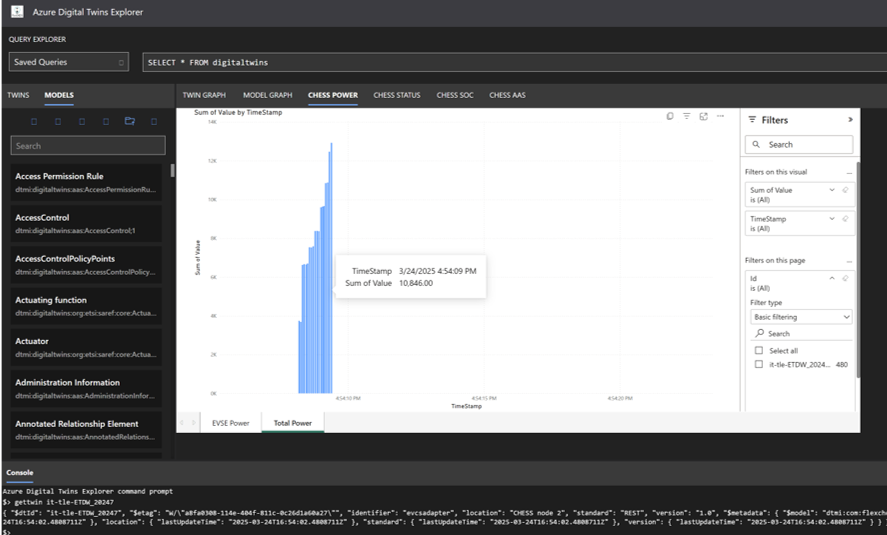
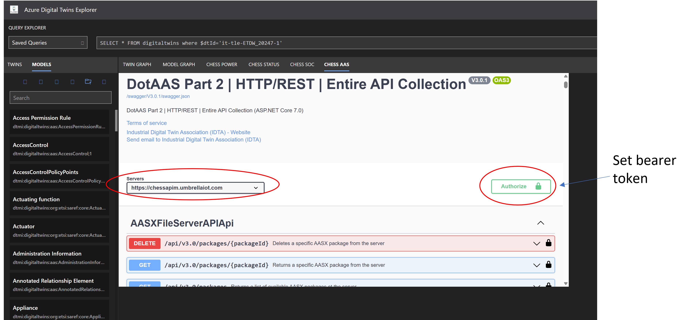
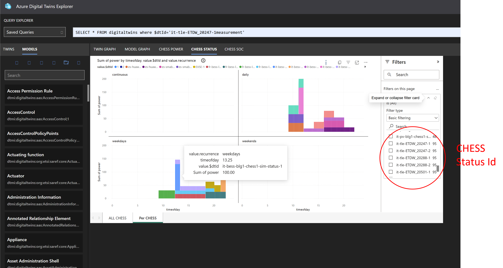
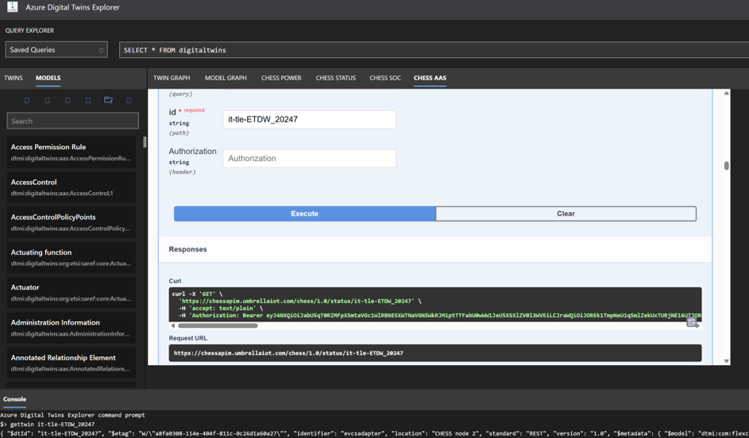

CHESS deployment overview
-------------------------

CHESS assets are deployed and registered with their corresponding Digital twins using adapters, which provide a common set of abstractions of CHESS assets. This is supported using the RabbitMQ broker, UUDEX and AAS Server as well as the core network API functions as shown below.  These are deployed in a CHESS node K3S environment which exposes a secure API gateway to access the AAS Server, UUDEX and core APIs.
The digital twin environment must contain the necessary AAS data models and digital twin instances, which can use the examples in ExportedGraph.json, by importing them through the DT explorer UI.  



The UUDEX is used to support the control and data planes with the Flex Platform using a message bus that exposes REST APIs that utilise the RabbitMQ server to provide the data  handling functions. The corresponding backing queues  are configured for fan out of data to different recipients which are CHESS nodes and the Flex platform services. Each adapter has two queues created - one for data (from CHESS to digitial twin environment) and the other for control (from the Flex platform or AAS Server to the CHESS). In the case of MQTT adapters  an additional MQTT client connection and associated queue is used to handle the forwarding of telemetry data from the local CHESS node.




1) Create DTDL definition of the CHESS
--------------------------------------

The DTDL editor extension within Visual Studio Code can be used to create the CHESS description using the template in  chess.json. However, adapters can also directly create the digital twin instances on the fly.
The DTDL uses the AAS submodels to describe the different views of the CHESS asset, such as EnergyEntity, PowerEntity, VoltageEntity and StateOfBatteryEntity.



The DTDL consists of the digital twin model which defines the data semantic structure and graphs that are the instances of the models using the AAS based data submodel templates.

2) Import DTDL into Azure environment
-------------------------------------

The DT explorer (https://preprodapim.umbrellaiot.com:9096) can be used to import the CHESS into the DT environemnt in Azure if the CHESS adapters do not support on the fly creation of digital twin instances.



3) Register CHESS with DT 
-------------------------
The CHESS node CoreAPI is used to register the CHESS with a CHESS node using the CHESS adapter provided as a container image. 

The sequence for CHESS registration and handling of data is shown in the following  diagram.



The register operation takes the following JSON example payload.

```
{"adapter":{
   "Identifier":"venusadapter",				
   "Location":"CHESS node 2",		
   "Standard":"Victron",	
   "Version":"1.0",
   "Id":"venusadapter",					    
   "Wireless":"test",
   "Container":"timfa/venus:latest",
   "Credentials":"default",
   "EnvConf":"saFlexibilityProvideraaa-bbb-ccc-ddd",
   "ExposedPort":80,
   "VolumeMount":""
  },
 "chess":[{
   "Identifier":"venusadapter",
   "Location":"lat lon",					
   "Standard":"MQTT",					 
   "Version":"3.1.1",
   "Id":"fr-bess-lab1-chess1-sim"
   }
]}
```

4) Explore data
---------------
The data relating to the digital twin can be explored using the DT explorer (https://preprodapim.umbrellaiot.com:9096) and the corresponding AAS Server provided APIs through the CHESS node.



The AAS Server APIs permit the retrieval of the status and capabilities including submodels provided for a CHESS by the adapter. Also, the viewing of the CHESS status and power profile information.







Example status structure for the request to control CHESS operation are invoked thorugh the CHESS API /status operations:
```
{
    "identifier":"simbessadapter",
    "currentStatus":"available",
    "status":[{
      "status":"ForceCharge",
      "service":"all",
      "starttime":"12:15",
      "endtime":"18:15",
      "capacity":"10000",
      "recurrence":"weekdays"
     },
     {
      "status":"ForceDischarge",
      "service":"all",
      "starttime":"18:15",
      "endtime":"22:15",
      "capacity":"10000",
      "recurrence":"weekdays"
    }]
}

```

5) Optimise day-ahead schedules
--------------------------------
Rather than setting each CHESS asset's status manually, the AAS Server's optimiser can compute
and dispatch a day-ahead schedule automatically: given a maximum site power demand limit and a
day-ahead demand/tariff forecast, it works out which registered assets to charge/discharge and
when so that predicted grid import never exceeds the limit while predicted cost is minimised,
then sets each affected CHESS's schedule for you via the EMS adapter - see
[AASServer/README.md](../AASServer/README.md#day-ahead-cost-minimising-optimiser) for the full
algorithm. Call the CHESS API `/run/dayahead` operation with the limit and forecast:

```
{
  "Limits": [{ "Name": "maxpower", "Unit": "W", "Value": 5000 }],
  "Demand": [3200, 3000, 2900, ... ],
  "Tariff": [0.1111, 0.1088, 0.1088, ... ],
  "PeriodHours": 1,
  "Recurrence": "daily",
  "Dispatch": true
}
```

This is complementary to, not a replacement for, the real-time limit enforcement that the EMS
adapter's `polling()` loop performs when a `limit` is passed to its own `/status/{id}` operation
directly - the day-ahead call plans ahead of time from a forecast, while `polling()` reacts to
live telemetry against the limit at runtime.
